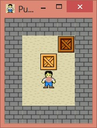

# Simple Pushbox Game in Java

This was developed by me in Oct 23th, 2014.

# Specification

Pushbox game is written in pure Java code. Also using some ArrayList, Graphics and Container Classes.

# Command to run

```sh
$ javac BPanel.java
$ java BPanel
```

# Below are the screenshots of the same.



# Author

[Bhagyesh Sunil Patel][1]

[1]: https://github.com/uzrnem
# pushbox-java-game
